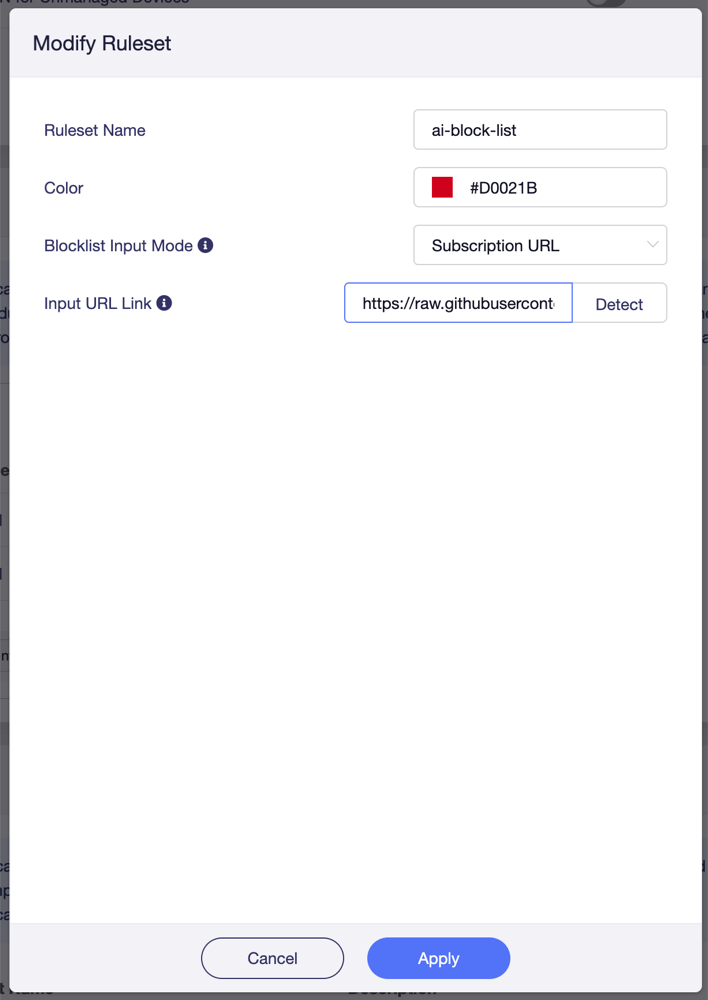
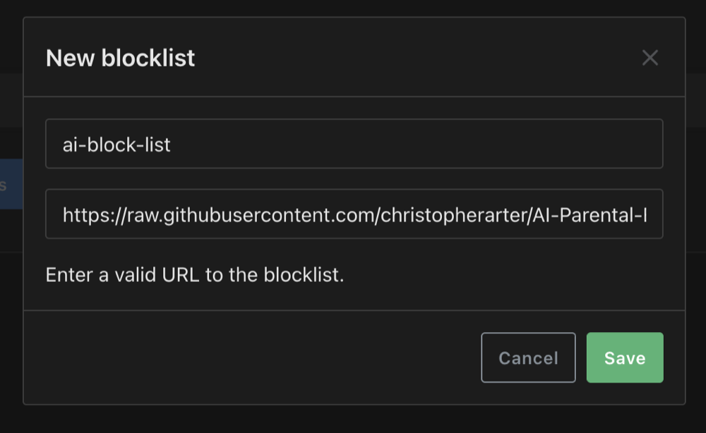

# AI Parental Block List

A ready-to-use DNS blocklist for keeping kids off AI sites: chatbots, AI image
and video generators, "AI homework helper" tools, etc. Point your home
router (or any DNS filter) at a single URL and it blocks those sites across every
device on the network.

It's built for parents running a **GL-iNet / OpenWrt router** (for example with
the Parental Controls app, or AdGuard Home), but it works with anything that can
load a remote blocklist — Pi-hole, AdGuard Home, Technitium, dnsmasq, and others.

The same domains are published in **two formats** so it works everywhere — pick
the one that matches your tool (see [Set up your router](#set-up-your-router)).

Set it once and forget it: both lists **refresh automatically every week**, so
there's nothing to keep up with by hand.

## Set up your router

There are two URLs. Use the one that matches your tool:

| Your tool | Format | URL |
| --- | --- | --- |
| **GL-iNet Parental Controls** app | plain domains | `…/main/ai-blocklist-domains.txt` |
| **AdGuard Home**, Pi-hole, dnsmasq, Technitium, … | HOSTS | `…/main/ai-blocklist.txt` |

> **Why two?** The GL-iNet Parental Controls "Detect" parser only accepts plain
> domain names, one per line — feed it the HOSTS file and every line fails to
> detect. AdGuard Home and Pi-hole want the HOSTS (`0.0.0.0 domain`) format.

### GL-iNet Parental Controls

Use the **plain-domains** URL:

```
https://raw.githubusercontent.com/christopherarter/AI-Parental-Block-List/main/ai-blocklist-domains.txt
```

In the GL-iNet admin panel, open **Parental Controls** and add a ruleset:

1. Set a **Ruleset Name** (e.g. `ai-block-list`).
2. Set **Blocklist Input Mode** to **Subscription URL**.
3. Paste the URL above into **Input URL Link**, then click **Detect**.
4. Click **Apply**.



### AdGuard Home

Use the **HOSTS** URL:

```
https://raw.githubusercontent.com/christopherarter/AI-Parental-Block-List/main/ai-blocklist.txt
```

1. Open AdGuard Home → **Filters → DNS blocklists → Add blocklist → Add a custom list**.
2. Name it (e.g. `ai-block-list`) and paste the URL above.
3. Save. AdGuard Home re-fetches the URL periodically on its own.



Any other DNS filter that accepts a remote HOSTS-format URL works the same way — give it the HOSTS URL.

## What it blocks

Around a thousand AI-related domains. So, stuff like chatbots, image and video generators,
voice/cloning tools, and AI "app" sites. The lists refresh weekly, so
newly-popular AI sites get picked up automatically.

The HOSTS list (`ai-blocklist.txt`) carries every entry from the source,
including a few that target a specific page on a larger site (e.g.
`adobe.com/products/firefly`). The plain-domains list
(`ai-blocklist-domains.txt`) drops those, because a DNS filter can only match a
whole domain — blocking them there would mean blocking all of Adobe, Amazon, and
so on. So the domains list is a little shorter, and everything in it is something
that can actually be blocked by domain.

If the source is ever unreachable or returns a bad response, the published lists
are left as-is rather than replaced with something broken or empty, so your
filter keeps working.

## Want your own additions?

To block extra sites the list doesn't cover, fork this repo, add your domains to
`custom-entries.txt` (one per line), and point your router at _your_ fork's raw
URL. Your fork keeps the same weekly auto-update.

## Credits

The upstream domain list is the
[HPT AI Blocklist](https://codeberg.org/lumiworx/HPT-AI-Blocklist).
